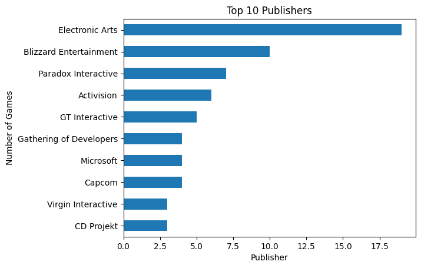
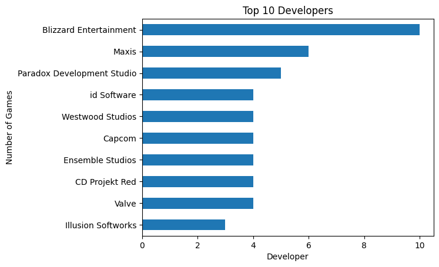
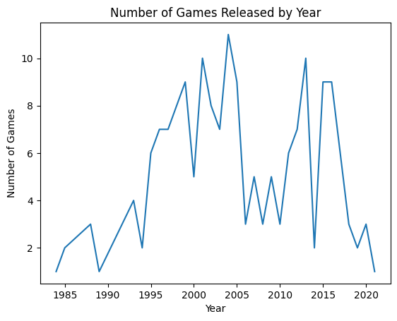
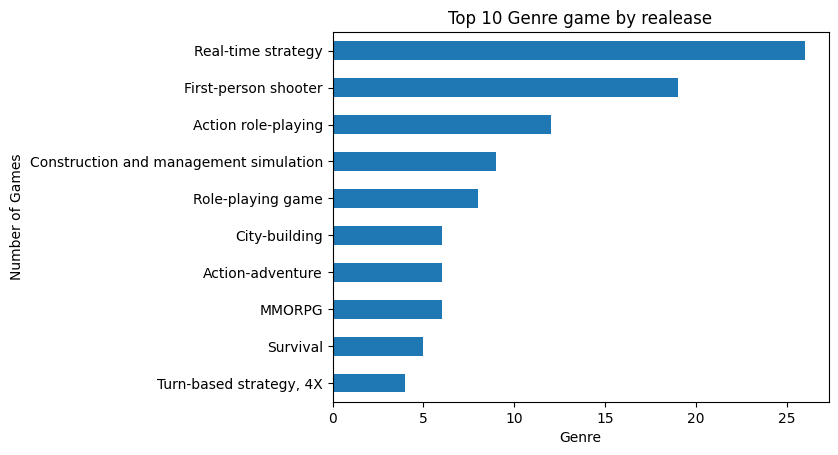

# GAME SALES ANALYSIS BY Sukma Ramadhan Asri

## Latar Belakang

Dataset ini berisi tentang data penjualan game yang diambil dari tahun 1984 hingga 2021. Dataset ini memiliki 7 kolom yang berisi tentang data penjualan game di dunia. Pada data ini dicari informasi tentang game yang paling laris, dan genre game yang paling banyak digemari dan lain sebagainya.

## Question Bussiness

Question Bussiness dibagi menjadi 2 bagian yaitu Specific dan Measurable
Specific adalah pertanyaan yang spesifik yang ingin dijawab dari data yang ada dan Measurable adalah pertanyaan yang bisa diukur dari data yang ada.

- Specific

  1. Game manakah yang paling laku terjual
  2. Publisher manakah yang paling banyak merilis game
  3. Developer manakah yang paling banyak membuat game
  4. Game yang paling terlama dan terbaru rilis di dalam data ini

- Measurable
  1. Berapa banyak penjualan game terbanyak
  2. Berapa banyak game yang dirilis oleh publisher terbanyak
  3. Berapa banyak game yang dibuat oleh developer terbanyak
  4. Berapa banyak game yang dirilis setiap tahunnya
  5. Series game manakah yang paling banyak penjualannya
  6. Genre game manakah yang paling banyak dibuat/rilis
  7. Genre game manakah yang paling banyak penjualannya

## Data Wrangling

1. cek data

```python
game_sales = pd.read_excel(DATA_DIR)
game_sales.head(10)
```

Output

<!-- masukan kode html -->
<div>
<table border="1" class="dataframe">
  <thead>
    <tr style="text-align: right;">
      <th></th>
      <th>Name</th>
      <th>Sales</th>
      <th>Series</th>
      <th>Release</th>
      <th>Genre</th>
      <th>Developer</th>
      <th>Publisher</th>
    </tr>
  </thead>
  <tbody>
    <tr>
      <th>0</th>
      <td>PlayerUnknown's Battlegrounds</td>
      <td>42.0</td>
      <td>NaN</td>
      <td>2017-12-01</td>
      <td>Battle royale</td>
      <td>PUBG Studios</td>
      <td>Krafton</td>
    </tr>
    <tr>
      <th>1</th>
      <td>Minecraft</td>
      <td>33.0</td>
      <td>Minecraft</td>
      <td>2011-11-01</td>
      <td>Sandbox, survival</td>
      <td>Mojang Studios</td>
      <td>Mojang Studios</td>
    </tr>
    <tr>
      <th>2</th>
      <td>Diablo III</td>
      <td>20.0</td>
      <td>Diablo</td>
      <td>2012-05-01</td>
      <td>Action role-playing</td>
      <td>Blizzard Entertainment</td>
      <td>Blizzard Entertainment</td>
    </tr>
    <tr>
      <th>3</th>
      <td>Garry's Mod</td>
      <td>20.0</td>
      <td>NaN</td>
      <td>2006-11-01</td>
      <td>Sandbox</td>
      <td>Facepunch Studios</td>
      <td>Valve</td>
    </tr>
    <tr>
      <th>4</th>
      <td>Terraria</td>
      <td>17.2</td>
      <td>NaN</td>
      <td>2011-05-01</td>
      <td>Action-adventure</td>
      <td>Re-Logic</td>
      <td>Re-Logic</td>
    </tr>
    <tr>
      <th>5</th>
      <td>World of Warcraft</td>
      <td>14.0</td>
      <td>Warcraft</td>
      <td>2004-11-01</td>
      <td>MMORPG</td>
      <td>Blizzard Entertainment</td>
      <td>Blizzard Entertainment</td>
    </tr>
    <tr>
      <th>6</th>
      <td>Half-Life 2</td>
      <td>12.0</td>
      <td>Half-Life</td>
      <td>2004-11-01</td>
      <td>First-person shooter</td>
      <td>Valve</td>
      <td>Valve (digital)</td>
    </tr>
    <tr>
      <th>7</th>
      <td>The Witcher 3: Wild Hunt</td>
      <td>12.0</td>
      <td>The Witcher</td>
      <td>2015-05-01</td>
      <td>Action role-playing</td>
      <td>CD Projekt Red</td>
      <td>CD Projekt</td>
    </tr>
    <tr>
      <th>8</th>
      <td>StarCraft</td>
      <td>11.0</td>
      <td>StarCraft</td>
      <td>1998-03-01</td>
      <td>Real-time strategy</td>
      <td>Blizzard Entertainment</td>
      <td>Blizzard Entertainment</td>
    </tr>
    <tr>
      <th>9</th>
      <td>The Sims</td>
      <td>11.0</td>
      <td>The Sims</td>
      <td>2000-02-01</td>
      <td>Life simulation</td>
      <td>Maxis</td>
      <td>Electronic Arts</td>
    </tr>
  </tbody>
</table>
</div>

2. cek info data

```python
game_sales.info()
```

output

```
<class 'pandas.core.frame.DataFrame'>
RangeIndex: 177 entries, 0 to 176
Data columns (total 7 columns):
 #   Column     Non-Null Count  Dtype
---  ------     --------------  -----
 0   Name       177 non-null    object
 1   Sales      177 non-null    float64
 2   Series     141 non-null    object
 3   Release    177 non-null    datetime64[ns]
 4   Genre      177 non-null    object
 5   Developer  177 non-null    object
 6   Publisher  177 non-null    object
dtypes: datetime64[ns](1), float64(1), object(5)
memory usage: 9.8+ KB
```

Dari data diatas, terdapat 177 baris dan 7 kolom. Kolom tersebut adalah:

- Name: Nama game
- Sales: Penjualan game (dalam Millyaran)
- Series: Nama series game
- Release: Tanggal rilis game
- Genre: Genre game
- Developer: Developer game
- Publisher: Publisher game

jika diperhatikan kolom Series memiliki nilai yang berbeda dengan kolom yang lainnya, hal ini dikarenakan kolom Series memiliki nilai NaN yang berarti tidak ada series game yang dimiliki oleh game tersebut.

3. cek missing value

Untuk mengecek missing value, kita bisa menggunakan fungsi `isna()` dan `sum()` untuk mengetahui jumlah missing value pada kolom Series

```python
game_sales.isna().sum()
```

output

```
Name          0
Sales         0
Series       36
Release       0
Genre         0
Developer     0
Publisher     0
```

Dari data diatas, terdapat 36 missing value pada kolom Series, untuk mengatasi missing value tersebut kita bisa mengganti nilai NaN dengan data yang diambil dari kolom Name.

4. mengganti missing value

Untuk mengganti missing value, kita bisa menggunakan fungsi `fillna()` untuk mengganti nilai NaN pada kolom Series dengan data yang diambil dari kolom Name.

```
game_sales['Series'] = game_sales['Series'].fillna(game_sales['Name'])
game_sales.head(10)
```

output

<div>
<table border="1" class="dataframe">
  <thead>
    <tr style="text-align: right;">
      <th></th>
      <th>Name</th>
      <th>Sales</th>
      <th>Series</th>
      <th>Release</th>
      <th>Genre</th>
      <th>Developer</th>
      <th>Publisher</th>
    </tr>
  </thead>
  <tbody>
    <tr>
      <th>0</th>
      <td>PlayerUnknown's Battlegrounds</td>
      <td>42.0</td>
      <td>PlayerUnknown's Battlegrounds</td>
      <td>2017-12-01</td>
      <td>Battle royale</td>
      <td>PUBG Studios</td>
      <td>Krafton</td>
    </tr>
    <tr>
      <th>1</th>
      <td>Minecraft</td>
      <td>33.0</td>
      <td>Minecraft</td>
      <td>2011-11-01</td>
      <td>Sandbox, survival</td>
      <td>Mojang Studios</td>
      <td>Mojang Studios</td>
    </tr>
    <tr>
      <th>2</th>
      <td>Diablo III</td>
      <td>20.0</td>
      <td>Diablo</td>
      <td>2012-05-01</td>
      <td>Action role-playing</td>
      <td>Blizzard Entertainment</td>
      <td>Blizzard Entertainment</td>
    </tr>
    <tr>
      <th>3</th>
      <td>Garry's Mod</td>
      <td>20.0</td>
      <td>Garry's Mod</td>
      <td>2006-11-01</td>
      <td>Sandbox</td>
      <td>Facepunch Studios</td>
      <td>Valve</td>
    </tr>
    <tr>
      <th>4</th>
      <td>Terraria</td>
      <td>17.2</td>
      <td>Terraria</td>
      <td>2011-05-01</td>
      <td>Action-adventure</td>
      <td>Re-Logic</td>
      <td>Re-Logic</td>
    </tr>
    <tr>
      <th>5</th>
      <td>World of Warcraft</td>
      <td>14.0</td>
      <td>Warcraft</td>
      <td>2004-11-01</td>
      <td>MMORPG</td>
      <td>Blizzard Entertainment</td>
      <td>Blizzard Entertainment</td>
    </tr>
    <tr>
      <th>6</th>
      <td>Half-Life 2</td>
      <td>12.0</td>
      <td>Half-Life</td>
      <td>2004-11-01</td>
      <td>First-person shooter</td>
      <td>Valve</td>
      <td>Valve (digital)</td>
    </tr>
    <tr>
      <th>7</th>
      <td>The Witcher 3: Wild Hunt</td>
      <td>12.0</td>
      <td>The Witcher</td>
      <td>2015-05-01</td>
      <td>Action role-playing</td>
      <td>CD Projekt Red</td>
      <td>CD Projekt</td>
    </tr>
    <tr>
      <th>8</th>
      <td>StarCraft</td>
      <td>11.0</td>
      <td>StarCraft</td>
      <td>1998-03-01</td>
      <td>Real-time strategy</td>
      <td>Blizzard Entertainment</td>
      <td>Blizzard Entertainment</td>
    </tr>
    <tr>
      <th>9</th>
      <td>The Sims</td>
      <td>11.0</td>
      <td>The Sims</td>
      <td>2000-02-01</td>
      <td>Life simulation</td>
      <td>Maxis</td>
      <td>Electronic Arts</td>
    </tr>
  </tbody>
</table>
</div>

Dari data diatas, terlihat bahwa kolom Series sudah tidak memiliki nilai NaN lagi. Kita dapat lihat bahwa kolom Series sudah diisi dengan data yang diambil dari kolom Name. contohnya pada kolom ke 1 dengan nama game "PlayerUnknown's Battlegrounds" dan kolom ke 3 dengan nama series "PlayerUnknown's Battlegrounds". Yang awalnya memiliki nilai NaN sekarang sudah diisi dengan nama game tersebut.

Cek kembali missing value

```python
game_sales.isna().sum()
```

output

```
Name         0
Sales        0
Series       0
Release      0
Genre        0
Developer    0
Publisher    0
```

Dari data diatas, terlihat bahwa kolom Series sudah tidak memiliki nilai NaN lagi.

## Visualisasi Data

Menjawab pertanyaan bussiness dengan visualisisasi data

- Specific Question

  1. Game manakah yang paling laku terjual

  ```python
    game_sales_max_sales = game_sales[game_sales['Sales'] == game_sales['Sales'].max()]
    game_sales_max_sales['Name']
  ```

  output

  ```
  PlayerUnknown's Battlegrounds
  ```

  2. Publisher manakah yang paling banyak merilis game

  

  Dari data diatas, terlihat bahwa publisher yang paling banyak merilis game adalah "Electronic Arts".

  3. Developer manakah yang paling banyak membuat game

  

  Dari data diatas, terlihat bahwa developer yang paling banyak membuat game adalah "Blizzard Entertainment".

  4. Game yang paling terlama dan terbaru rilis di dalam data ini

  ```python
    game_realease_new = pd.to_datetime(game_sales['Release'])
    game_sales_new = game_sales['Release'].max()
    game_sales_new = game_sales[game_sales['Release'] == game_sales_new][['Name', 'Release', 'Sales']]
    print('Game with the most recent release date (in dataset):')
    print(game_sales_new)
    print('\n')
    game_realease_old = pd.to_datetime(game_sales['Release'])
    game_sales_old = game_sales['Release'].min()
    game_sales_old = game_sales[game_sales['Release'] == game_sales_old][['Name', 'Release',    'Sales']]
    print('Game with the most oldest release date (in dataset):')
    print(game_sales_old)
  ```

  Output

  ```
  Game with the most recent release date (in dataset):
     Name    Release  Sales
  20  Valheim 2021-02-01    6.0


  Game with the most oldest release date (in dataset):
      Name    Release  Sales
  133  Hydlide 1984-12-01    1.0
  ```

  Game dengan rilis terbaru adalah "Valheim" dengan rilis pada tahun 2021-02-01 dan game dengan rilis terlama adalah "Hydlide" dengan rilis pada tahun 1984-12-01.

- Measurable Question
  1. Berapa banyak penjualan game terbanyak
  ```python
    game_sales_max_sales = game_sales[game_sales['Sales'] == game_sales['Sales'].max()]
    game_sales_max_sales[['Name', 'Sales']]
  ```

<div>
  <table border="1" class="dataframe">
    <thead>
      <tr style="text-align: right;">
        <th></th>
        <th>Name</th>
        <th>Sales</th>
      </tr>
    </thead>
    <tbody>
      <tr>
        <th>0</th>
        <td>PlayerUnknown's Battlegrounds</td>
        <td>42.0</td>
      </tr>
    </tbody>
  </table>
  </div>

Game dengan penjualan terbanyak adalah "PlayerUnknown's Battlegrounds" dengan penjualan sebesar 42.0 M

2. Berapa banyak game yang dirilis oleh publisher terbanyak

Electronic Arts: 19

<div>
<table border="1" class="dataframe">
  <thead>
    <tr style="text-align: right;">
      <th></th>
      <th>Name</th>
      <th>Developer</th>
      <th>Series</th>
      <th>Genre</th>
      <th>Release</th>
      <th>Sales</th>
      <th>Publisher</th>
    </tr>
  </thead>
  <tbody>
    <tr>
      <th>9</th>
      <td>The Sims</td>
      <td>Maxis</td>
      <td>The Sims</td>
      <td>Life simulation</td>
      <td>2000-02-01</td>
      <td>11.0</td>
      <td>Electronic Arts</td>
    </tr>
    <tr>
      <th>15</th>
      <td>The Sims 3</td>
      <td>Maxis</td>
      <td>The Sims</td>
      <td>Life simulation</td>
      <td>2009-06-01</td>
      <td>7.0</td>
      <td>Electronic Arts</td>
    </tr>
    <tr>
      <th>19</th>
      <td>The Sims 2</td>
      <td>Maxis</td>
      <td>The Sims</td>
      <td>Life simulation</td>
      <td>2004-09-01</td>
      <td>6.0</td>
      <td>Electronic Arts</td>
    </tr>
    <tr>
      <th>25</th>
      <td>SimCity 3000</td>
      <td>Maxis</td>
      <td>SimCity</td>
      <td>City-building</td>
      <td>1999-01-01</td>
      <td>5.0</td>
      <td>Electronic Arts</td>
    </tr>
    <tr>
      <th>30</th>
      <td>Populous</td>
      <td>Bullfrog Productions</td>
      <td>Populous</td>
      <td>God game</td>
      <td>1989-06-01</td>
      <td>4.0</td>
      <td>Electronic Arts</td>
    </tr>
    <tr>
      <th>41</th>
      <td>Crysis</td>
      <td>Crytek</td>
      <td>Crysis</td>
      <td>First-person shooter</td>
      <td>2007-11-01</td>
      <td>3.0</td>
      <td>Electronic Arts</td>
    </tr>
    <tr>
      <th>44</th>
      <td>Theme Park</td>
      <td>Bullfrog Productions</td>
      <td>Theme Park</td>
      <td>Construction and management simulation</td>
      <td>2005-06-01</td>
      <td>3.0</td>
      <td>Electronic Arts</td>
    </tr>
    <tr>
      <th>76</th>
      <td>SimCity</td>
      <td>Electronic Arts</td>
      <td>SimCity</td>
      <td>City-building</td>
      <td>2013-03-01</td>
      <td>2.0</td>
      <td>Electronic Arts</td>
    </tr>
    <tr>
      <th>79</th>
      <td>Spore</td>
      <td>Maxis</td>
      <td>Spore</td>
      <td>God game</td>
      <td>2008-09-01</td>
      <td>2.0</td>
      <td>Electronic Arts</td>
    </tr>
    <tr>
      <th>60</th>
      <td>Battlefield 1942</td>
      <td>EA DICE</td>
      <td>Battlefield</td>
      <td>First-person shooter</td>
      <td>2002-09-01</td>
      <td>2.0</td>
      <td>Electronic Arts</td>
    </tr>
    <tr>
      <th>99</th>
      <td>American McGee's Alice</td>
      <td>Rogue Entertainment</td>
      <td>Alice</td>
      <td>Action-adventure, platformer</td>
      <td>2000-10-01</td>
      <td>1.0</td>
      <td>Electronic Arts</td>
    </tr>
    <tr>
      <th>101</th>
      <td>Battlefield Vietnam</td>
      <td>EA DICE</td>
      <td>Battlefield</td>
      <td>First-person shooter</td>
      <td>2004-03-01</td>
      <td>1.0</td>
      <td>Electronic Arts</td>
    </tr>
    <tr>
      <th>105</th>
      <td>Command &amp; Conquer 3: Tiberium Wars</td>
      <td>EA Los Angeles</td>
      <td>Command &amp; Conquer</td>
      <td>Real-time strategy</td>
      <td>2007-03-01</td>
      <td>1.0</td>
      <td>Electronic Arts</td>
    </tr>
    <tr>
      <th>106</th>
      <td>Command &amp; Conquer: Red Alert 2</td>
      <td>Westwood Pacific</td>
      <td>Command &amp; Conquer</td>
      <td>Real-time strategy</td>
      <td>2000-10-01</td>
      <td>1.0</td>
      <td>Electronic Arts</td>
    </tr>
    <tr>
      <th>107</th>
      <td>Command &amp; Conquer: Tiberian Sun</td>
      <td>Westwood Studios</td>
      <td>Command &amp; Conquer</td>
      <td>Real-time strategy</td>
      <td>1999-08-01</td>
      <td>1.0</td>
      <td>Electronic Arts</td>
    </tr>
    <tr>
      <th>111</th>
      <td>Crysis Warhead</td>
      <td>Crytek Budapest</td>
      <td>Crysis</td>
      <td>First-person shooter</td>
      <td>2008-09-01</td>
      <td>1.0</td>
      <td>Electronic Arts</td>
    </tr>
    <tr>
      <th>127</th>
      <td>Harry Potter and the Philosopher's Stone</td>
      <td>KnowWonder</td>
      <td>Harry Potter</td>
      <td>Action-adventure</td>
      <td>2001-11-01</td>
      <td>1.0</td>
      <td>Electronic Arts</td>
    </tr>
    <tr>
      <th>171</th>
      <td>Warhammer Online: Age of Reckoning</td>
      <td>Mythic Entertainment</td>
      <td>Warhammer</td>
      <td>MMORPG</td>
      <td>2008-09-01</td>
      <td>1.0</td>
      <td>Electronic Arts</td>
    </tr>
    <tr>
      <th>173</th>
      <td>Wing Commander 3: Heart of the Tiger</td>
      <td>Origin Systems</td>
      <td>Wing Commander</td>
      <td>Space combat simulation</td>
      <td>1994-12-01</td>
      <td>1.0</td>
      <td>Electronic Arts</td>
    </tr>
  </tbody>
</table>
</div>

3. Berapa banyak game yang dibuat oleh developer terbanyak

Blizzard Entertainment: 10

<div>
<table border="1" class="dataframe">
  <thead>
    <tr style="text-align: right;">
      <th></th>
      <th>Name</th>
      <th>Developer</th>
      <th>Series</th>
      <th>Genre</th>
      <th>Release</th>
      <th>Sales</th>
      <th>Publisher</th>
    </tr>
  </thead>
  <tbody>
    <tr>
      <th>2</th>
      <td>Diablo III</td>
      <td>Blizzard Entertainment</td>
      <td>Diablo</td>
      <td>Action role-playing</td>
      <td>2012-05-01</td>
      <td>20.0</td>
      <td>Blizzard Entertainment</td>
    </tr>
    <tr>
      <th>5</th>
      <td>World of Warcraft</td>
      <td>Blizzard Entertainment</td>
      <td>Warcraft</td>
      <td>MMORPG</td>
      <td>2004-11-01</td>
      <td>14.0</td>
      <td>Blizzard Entertainment</td>
    </tr>
    <tr>
      <th>8</th>
      <td>StarCraft</td>
      <td>Blizzard Entertainment</td>
      <td>StarCraft</td>
      <td>Real-time strategy</td>
      <td>1998-03-01</td>
      <td>11.0</td>
      <td>Blizzard Entertainment</td>
    </tr>
    <tr>
      <th>18</th>
      <td>StarCraft II: Wings of Liberty</td>
      <td>Blizzard Entertainment</td>
      <td>StarCraft</td>
      <td>Real-time strategy</td>
      <td>2010-07-01</td>
      <td>6.0</td>
      <td>Blizzard Entertainment</td>
    </tr>
    <tr>
      <th>45</th>
      <td>Warcraft III: Reign of Chaos</td>
      <td>Blizzard Entertainment</td>
      <td>Warcraft</td>
      <td>Real-time strategy</td>
      <td>2002-07-01</td>
      <td>3.0</td>
      <td>Blizzard Entertainment (North America)</td>
    </tr>
    <tr>
      <th>85</th>
      <td>Warcraft II: Tides of Darkness</td>
      <td>Blizzard Entertainment</td>
      <td>Warcraft</td>
      <td>Real-time strategy</td>
      <td>1995-12-01</td>
      <td>2.0</td>
      <td>Blizzard Entertainment</td>
    </tr>
    <tr>
      <th>157</th>
      <td>StarCraft II: Heart of the Swarm</td>
      <td>Blizzard Entertainment</td>
      <td>StarCraft</td>
      <td>Real-time strategy</td>
      <td>2013-03-01</td>
      <td>1.0</td>
      <td>Blizzard Entertainment</td>
    </tr>
    <tr>
      <th>158</th>
      <td>StarCraft II: Legacy of the Void</td>
      <td>Blizzard Entertainment</td>
      <td>StarCraft</td>
      <td>Real-time strategy</td>
      <td>2015-11-01</td>
      <td>1.0</td>
      <td>Blizzard Entertainment</td>
    </tr>
    <tr>
      <th>175</th>
      <td>StarCraft II: Heart of the Swarm</td>
      <td>Blizzard Entertainment</td>
      <td>StarCraft</td>
      <td>Real-time strategy</td>
      <td>2013-03-01</td>
      <td>1.0</td>
      <td>Blizzard Entertainment</td>
    </tr>
    <tr>
      <th>176</th>
      <td>StarCraft II: Legacy of the Void</td>
      <td>Blizzard Entertainment</td>
      <td>StarCraft</td>
      <td>Real-time strategy</td>
      <td>2015-11-01</td>
      <td>1.0</td>
      <td>Blizzard Entertainment</td>
    </tr>
  </tbody>
</table>
</div>

4. Berapa banyak game yang dirilis setiap tahunnya

   

Data data diatas, terlihat bahwa grafik menunjukkan bahwa game yang dirilis setiap tahunnya tidak stabil, terkesan naik turun.

5. Series game manakah yang paling banyak penjualannya

`   Series
    PlayerUnknown's Battlegrounds    42.0
    Minecraft                        33.0
    Diablo                           26.0
    The Sims                         24.0
    Half-Life                        21.0
  `

Series game dengan penjualan terbanyak adalah "PlayerUnknown's Battlegrounds" dengan penjualan sebesar 42

6. Genre game manakah yang paling banyak dibuat/rilis



Dari data diatas, terlihat bahwa genre game yang paling banyak dibuat/rilis adalah "Real-time strategy' 7. Genre game manakah yang paling banyak penjualannya

7. enre game manakah yang paling banyak penjualannya

```
Genre
Action role-playing     58.1
Real-time strategy      57.0
Battle royale           52.0
First-person shooter    46.0
Sandbox, survival       33.0
```

Genre game dengan penjualan terbanyak adalah "Action role-playing" dengan penjualan sebesar 58.1 m

## Kesimpulan

Hasil dari analisis data ini adalah:

1. Game yang paling laku terjual adalah "PlayerUnknown's Battlegrounds" dengan penjualan sebesar 42.0 M
2. Publisher yang paling banyak merilis game adalah "Electronic Arts" dengan jumlah game yang dirilis sebanyak 19
3. Developer yang paling banyak membuat game adalah "Blizzard Entertainment" dengan jumlah game yang dibuat sebanyak 10
4. Game dengan rilis terbaru adalah "Valheim" dengan rilis pada tahun 2021-02-01 dan game dengan rilis terlama adalah "Hydlide" dengan rilis pada tahun 1984-12-01
5. Game dengan penjualan terbanyak adalah "PlayerUnknown's Battlegrounds" dengan penjualan sebesar 42.0 M
6. Series game dengan penjualan terbanyak adalah "PlayerUnknown's Battlegrounds" dengan penjualan sebesar 42
7. Genre game yang paling banyak dibuat/rilis adalah "Real-time strategy"
8. Genre game dengan penjualan terbanyak adalah "Action role-playing" dengan penjualan sebesar 58.1 m

## Saran

Dari hasil analisis data diatas, dapat disimpulkan bahwa game dengan genre "Action role-playing" adalah genre game yang paling banyak dibuat/rilis dan juga memiliki penjualan terbanyak. Maka dari itu, disarankan untuk membuat game dengan genre "Action role-playing" karena genre ini memiliki peluang yang besar untuk laku terjual. Selain itu, disarankan juga untuk bekerja sama dengan developer "Blizzard Entertainment" karena developer ini adalah developer yang paling banyak membuat game.
